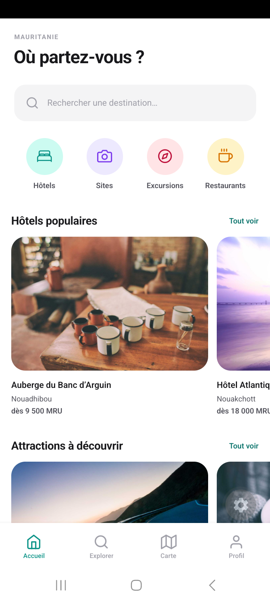
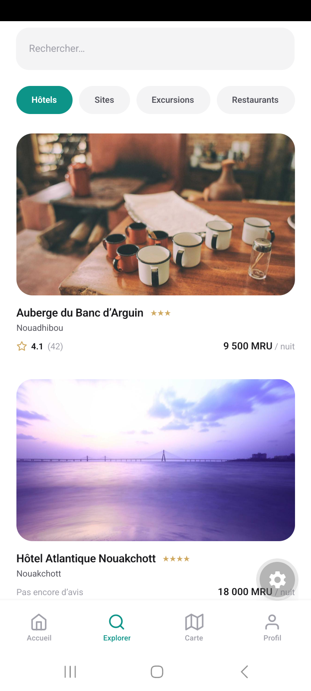
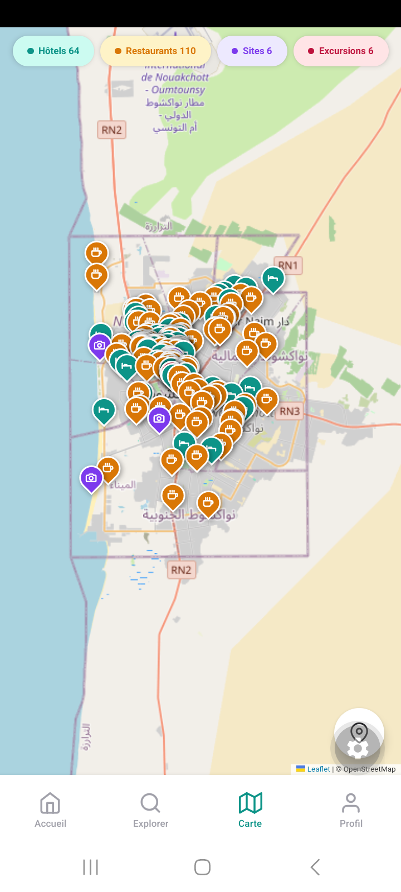
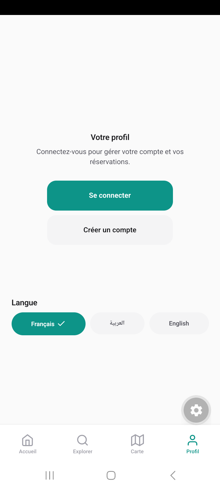
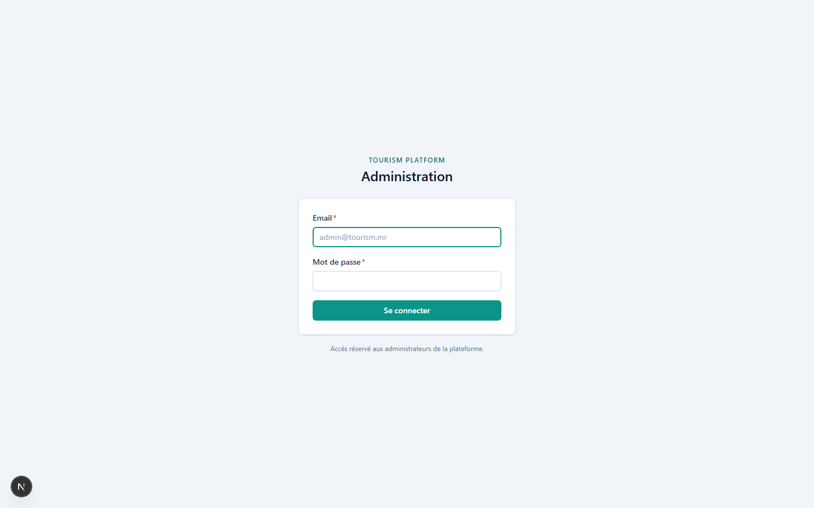
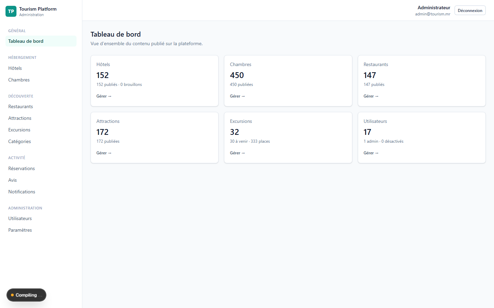
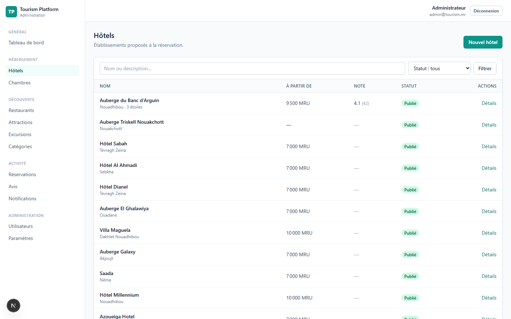
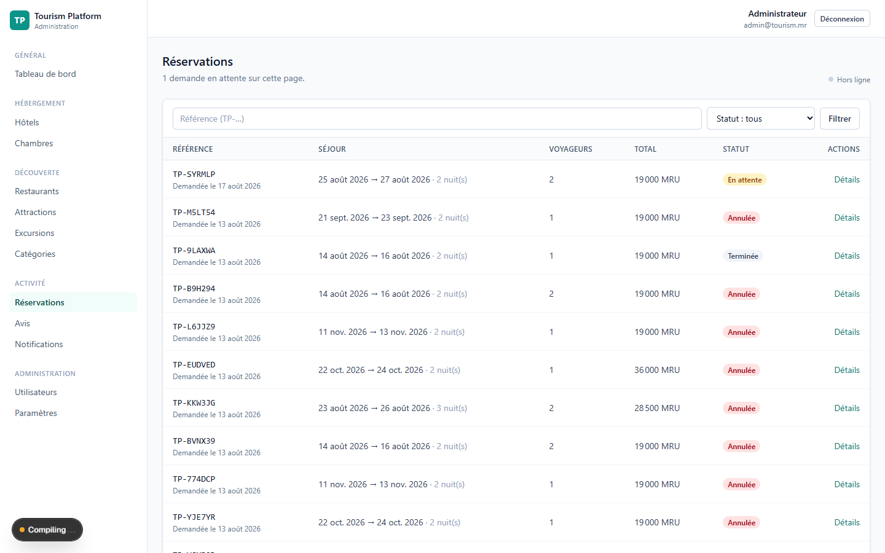
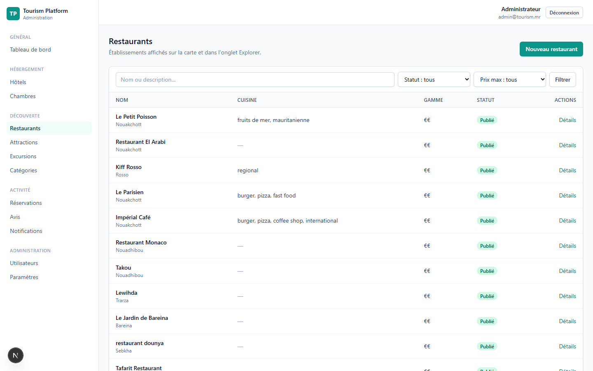
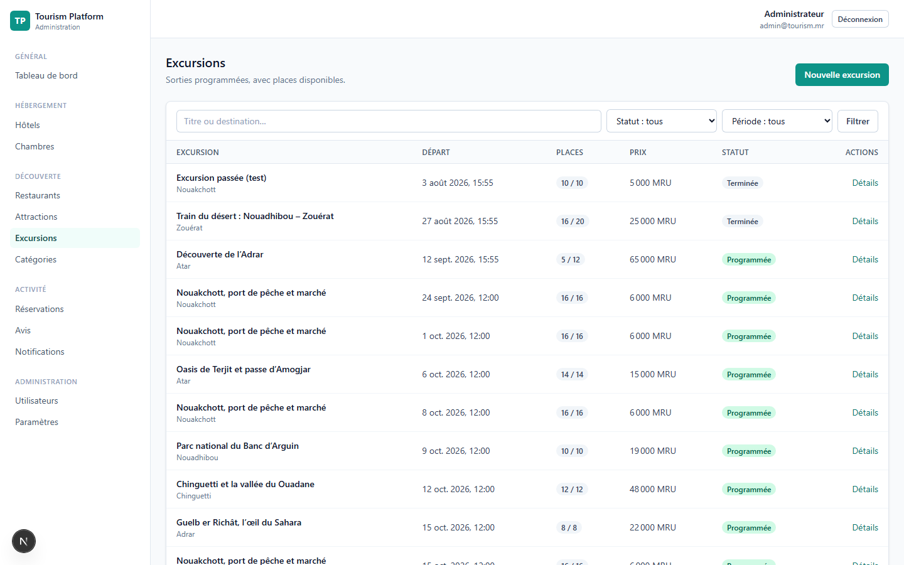

# Tourism Platform

Plateforme touristique tout-en-un : hôtels, chambres, restaurants, attractions et
excursions, avec carte interactive, réservation, avis et notifications.
Marché initial : la **Mauritanie**, avec une architecture multi-pays.

## Applications

| Dossier      | Rôle                                  | Pile                                    |
| ------------ | ------------------------------------- | --------------------------------------- |
| `mobile/`    | Application touriste                  | React Native (Expo) · TypeScript        |
| `dashboard/` | Administration                        | Next.js · TypeScript · Tailwind CSS v4  |
| `backend/`   | API REST unique                       | Next.js route handlers · MongoDB        |
| `realtime/`  | Diffusion temps réel                  | Node · Socket.IO                        |
| `worker/`    | Traitements asynchrones               | Node · BullMQ · Redis                   |
| `shared/`    | Types, constantes, validation Zod     | TypeScript                              |
| `docs/`      | Documentation                         | Markdown                                |

Le mobile et le dashboard consomment **la même API**. Aucune logique métier n'est
dupliquée côté client.

## Aperçu

### Application mobile

Application touriste : recherche, carte, réservation. Interface en français,
arabe et anglais.

| Accueil | Explorer |
| --- | --- |
|  |  |

| Carte | Profil |
| --- | --- |
|  |  |

La carte est rendue par **Leaflet sur les tuiles OpenStreetMap** : aucune clé
d'API, aucun compte de facturation. Chaque repère porte l'icône de sa catégorie
et la couleur qui lui correspond sur tous les écrans — un point orange et un
disque orange désignent la même chose.

Le rond gris en bas à droite des captures est la bulle de développement d'Expo
Go ; elle n'existe pas dans une application compilée.

### Tableau de bord

Administration des contenus et des réservations, réservée aux comptes
administrateurs.

| Connexion | Vue d'ensemble |
| --- | --- |
|  |  |

| Hôtels | Réservations |
| --- | --- |
|  |  |

| Restaurants | Excursions |
| --- | --- |
|  |  |

Les captures se régénèrent avec :

```bash
node scripts/capture-dashboard.mjs      # tableau de bord, via le Chrome installé
adb exec-out screencap -p > docs/screenshots/mobile-accueil.png
```

### Sur les données affichées

Les lieux proviennent d'**OpenStreetMap** (licence ODbL) : noms, adresses et
coordonnées sont réels. En revanche les **photographies sont des illustrations
génériques** et les **tarifs sont inventés** — aucun établissement ne les a
communiqués. Ils conviennent à une démonstration ; ils doivent être remplacés
par les données des établissements avant toute ouverture au public.

## Démarrage rapide

```bash
npm install                        # depuis la racine — lie les 4 workspaces

cp backend/.env.example   backend/.env.local
cp dashboard/.env.example dashboard/.env.local
cp mobile/.env.example    mobile/.env.local
# renseigner MONGODB_URI et JWT_SECRET dans backend/.env.local

npm run dev:backend                # http://localhost:4000
npm run dev:dashboard              # http://localhost:3000
npm run dev:realtime               # :4100 (facultatif)
npm run dev:worker                 # files BullMQ (facultatif)
npm run dev:mobile                 # Expo

npm run seed  --workspace backend    # données de développement
npm run smoke --workspace backend    # 40 vérifications API
npm run smoke --workspace dashboard  # 30 vérifications dashboard
npm run test:journey --workspace mobile  # parcours mobile de bout en bout
```

Détails, prérequis et dépannage : [`docs/development.md`](docs/development.md).

## Commandes

```bash
npm run typecheck      # TypeScript sur les 4 workspaces
npm run lint           # ESLint
npm run format         # Prettier
npm run build          # build de production backend + dashboard
```

## Documentation

| Document                                     | Contenu                                        |
| -------------------------------------------- | ---------------------------------------------- |
| [architecture.md](docs/architecture.md)      | Structure, frontières, décisions techniques    |
| [database.md](docs/database.md)              | Collections, index, géolocalisation, intégrité |
| [api.md](docs/api.md)                        | Contrat REST, codes d'erreur, autorisations    |
| [development.md](docs/development.md)        | Installation, conventions, dépannage           |
| [security.md](docs/security.md)              | Secrets, authentification, validation, CORS    |
| [deployment.md](docs/deployment.md)          | Vercel, VPS, mise à l'échelle                  |

## Avancement

| Phase | Objet                                | État       |
| ----- | ------------------------------------ | ---------- |
| 1     | Fondation du monorepo                | ✅ terminée |
| 2     | Modèles et endpoints backend         | ✅ terminée |
| 3     | Dashboard et CRUD                    | ✅ terminée |
| 4     | Préparation du déploiement           | ✅ terminée |
| 5     | Application mobile et réservation    | ✅ terminée |
| 6     | Carte interactive                    | ✅ terminée |
| 7     | Photos et galeries                   | ✅ terminée |
| 8     | Authentification et réservations     | ✅ terminée |
| 9     | Réservation d'excursions             | ✅ terminée |
| 10    | Favoris, avis et modération          | ✅ terminée |
| 11    | Notifications et emails              | ✅ terminée |
| 12    | Temps réel (Socket.IO)               | ✅ terminée |
| 13    | Redis, files BullMQ, limitation de débit | ✅ terminée |
| 14    | Sécurité de production                | ✅ terminée |
| 15    | Migration VPS (Docker, Nginx, TLS)    | ✅ terminée |
| 16    | Mise à l'échelle                      | ✅ terminée |


## Licence

Projet privé.
